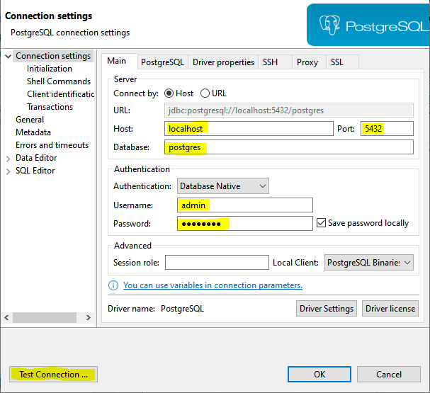
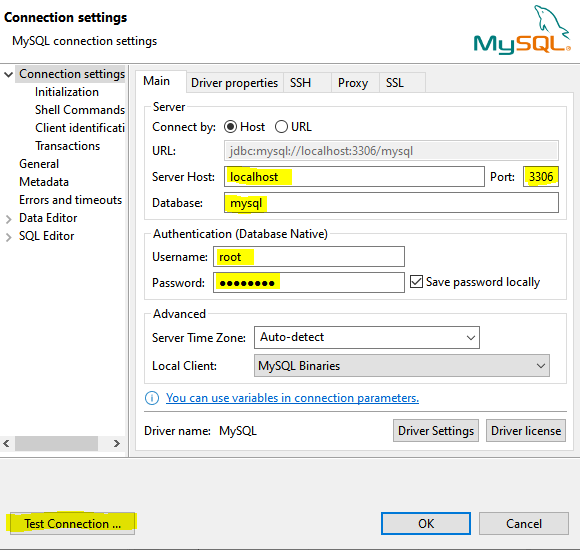
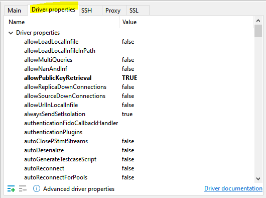
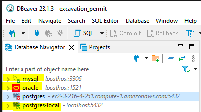

# Multiple databases for Spring Boot

This tutorial shows how to run Spring Application using multiple databases. Database will be
1. PosrgreSQL database
2. MySQL database
3. Oracle database

As a bonus we will also show how to make a native native query and how to handle them.

### Technology used
1. Docker
2. Dbeaver
3. Spring Boot

### Step 1: Start the DB service on your local machine

We will be using docker to start the DB service. [Download](https://www.docker.com/products/docker-desktop/) and install if you haven't yet. Once done, simply run the following command to start:

    docker run -d --name postgres -e POSTGRES_PASSWORD=password -e POSTGRES_USER=admin -p 5432:5432 postgres

    docker run -d --name mysql -e MYSQL_PASSWORD=password -e MYSQL_USER=admin -e MYSQL_ROOT_PASSWORD=password -e MYSQL_DATABASE=mydb -p 3306:3306 mysql

    docker run -d --name oracle -p 1521:1521 -e ORACLE_PWD=password container-registry.oracle.com/database/express:latest

### Step 2: Check if the DB service is running using Dbeaver.

There are many different ways to check the DB service. The usual method is to download the db service platform and establish the connection. For e.g. for Postgres, you have to install PgAdmin. For Mysql, you have to install MySql workbench, and so on. Imagine if there are 10 different db and you have to install 10 different platform. To overcome this, we can just install [Dbeaver](https://dbeaver.io/download/). Is it a universal database manager that manages all database types. The values you input into the connection settings will vary on what is the variables passed during initialization of docker containers.

<b>Postgres</b>

<b>Mysql</b>

Also make sure you change the configuration under driver properties.

    allowPublicKeyRetrieval=true
    useSSL=false

[MySQL issue](https://stackoverflow.com/questions/50379839/connection-java-mysql-public-key-retrieval-is-not-allowed)

<b>Oracle</b>

If you are not sure what is the variable values for this, you can view inside:

    cat /opt/oracle/homes/OraDBHome21cXE/network/admin/tnsnames.ora

[Oracle issue](https://logic.edchen.org/how-to-resolve-ora-12514-tns-listener-does-not-currently-know-of-service-requested-in-connect-descriptor/)

Once all connection is done, you will have something like this:

### Step 3 - Run your Spring application

With the already defined configurations, simply start the application. There are data ready to be be inserted upon start of application so you can view this in the logs. Oracle has special configuration so refer [here](https://thorben-janssen.com/jdbc-connection-and-dialect-in-hibernate/) if you are facing any issue.

### Step 4 - Testing using Swagger

Swagger is already set up for you with all the information so simply just start the app then run the following url in your browser:

    http://localhost:8087/swagger-ui/index.html#/

### Useful resources

[Swagger setup](https://medium.com/@stefan.paladuta17/spring-boot-using-swagger-at-maximum-grouping-definition-tag-2b25eb39a0cb)

[Sample reference](https://github.com/spring-framework-guru/sfg-blog-posts/blob/api-gateway/multiple-data-sources/src/main/java/guru/springframework/multipledatasources/model/member/Member.java)

[Sample reference](https://github.com/eugenp/tutorials/blob/master/persistence-modules/spring-data-jpa-enterprise-2/src/main/java/com/baeldung/multipledb/PersistenceProductConfiguration.java)

